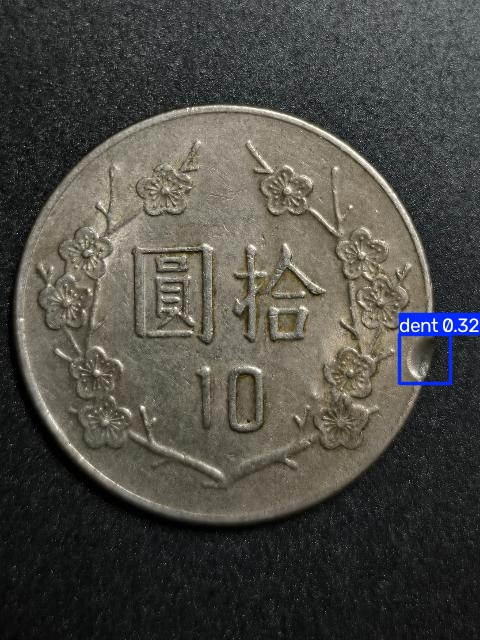
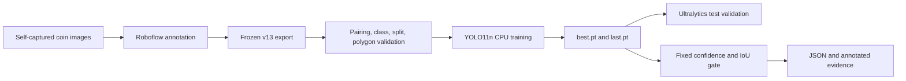

# Coin-AOI

Coin-AOI is a portfolio computer-vision project that turns self-captured coin
images into a reproducible object-detection experiment: annotate defects,
validate the dataset, fine-tune YOLO11n, and evaluate a frozen checkpoint with
an explicit smoke gate.

The engineering pipeline is complete and reviewable. The current model is not
a production inspector: it detects the held-out dent case and rejects the
normal case, but misses the held-out scratch case.



## Current status

| Item | Verified state |
| --- | --- |
| Dataset | Roboflow v13 export, 102 images (`93/6/3`) |
| Local model | YOLO11n, 100 epochs, CPU, 640px, batch 2, seed 0 |
| Fixed gate | Confidence `0.25`, same-class IoU `0.50` |
| Outcome | **Failed**: dent and normal passed; scratch was missed |
| Interpretation | Pipeline evidence only; the test split is too small for an accuracy claim |

## What I built

- Python CLIs for inference, dataset validation, training, and fixed evaluation.
- A leakage-aware data workflow that keeps captures of one physical coin in a
  single train, validation, or test group.
- YOLO box parsing with automatic polygon-to-box conversion and class-ID checks.
- Reproducible CPU training with fixed seed, deterministic mode, and online
  augmentation disabled for an already augmented export.
- A three-image acceptance gate with same-class IoU matching, per-image JSON,
  annotated predictions, and preserved failure diagnostics.
- Unit tests for path resolution, label conversion, matching, misses, false
  positives, and a secret-safe Roboflow REST client.
- An AI-assisted development workflow in which generated code and experiment
  ideas are constrained by tests, frozen gates, and manually verified claims.

## Current v13 pipeline



## Frozen smoke result

| Case | Expected | Prediction at 0.25 | IoU | Result |
| --- | --- | --- | ---: | --- |
| `C005_03` | `scratch` | none | — | **Fail** |
| `C006_01` | no defect | none | — | Pass |
| `C013_01` | `dent` | `dent` at 0.321 | 0.744 | Pass |

The blank [C005 prediction](artifacts/v13-yolo11n/c005-scratch-missed.jpg)
is a missed ground-truth scratch, not a normal coin. The
[normal C006 prediction](artifacts/v13-yolo11n/c006-normal-clear.jpg),
[training curves](artifacts/v13-yolo11n/training-curves.png), and portable
[smoke summary](artifacts/v13-yolo11n/smoke-summary.json) are tracked for
review. Extra test metrics are diagnostic only because the split has three
images and two ground-truth instances.

## Quickstart

Create an isolated environment and install the pinned Ultralytics version:

```bash
python3 -m venv .venv
source .venv/bin/activate
python -m pip install -r requirements.txt
```

Run the offline test suite:

```bash
python -m unittest discover -s tests -v
```

Raw images, Roboflow exports, model weights, and full run directories are not
committed. Download the v13 YOLO export to
`data/roboflow/v13-cloud-augmented/`; the tracked
`datasets/coin-defect-v13/data.yaml` resolves the expected `93/6/3` split.
See the [dataset workflow](data/README.md) for the data contract.

Run the one-epoch integration preflight:

```bash
python src/train_v13.py \
  --model yolo11n.pt --epochs 1 \
  --run-name v13-yolo11n-preflight-e1-i640-s0
```

Start a fresh 100-epoch run and test validation:

```bash
python src/train_v13.py \
  --model yolo11n.pt --epochs 100 \
  --run-name v13-yolo11n-cpu-e100-i640-s0 \
  --test-after-train
```

Evaluate the frozen primary checkpoint:

```bash
python src/evaluate_v13.py \
  --model runs/detect/v13/v13-yolo11n-cpu-e100-i640-s0/weights/best.pt \
  --output-dir outputs/v13-evaluation/v13-yolo11n-cpu-e100-i640-s0-primary
```

The evaluator exits non-zero when the gate fails while still preserving all
evidence. It does not tune the threshold or retrain from the test result.

## Repository map

```text
src/                  current inference, validation, v13 training and evaluation
tests/                offline unit tests; hosted live test remains opt-in
datasets/             tracked YOLO descriptors; images and labels stay local
data/                 manifests and dataset workflow documentation
artifacts/            small, public, secret-free experiment evidence
experiments/legacy/   earlier smoke, baseline, dent, and rim experiments
docs/                 case study, architecture, experiment log, and decisions
```

## Optional hosted integration

`src/inference_roboflow.py` implements an API-key-safe Roboflow Workflow
client with bounded retries and compact evidence output. The published v9
endpoint last returned HTTP 500, so it is documented as an integration failure,
not a successful demo. Roboflow's separate v13 cloud training used 300 epochs;
its engine and settings are not treated as directly comparable to the local
100-epoch run. See the [experiment log](docs/EXPERIMENTS.md).

## Limitations and next step

- This project has no validated production accuracy, real-time camera loop, or
  deterministic quality-control decision.
- An empty prediction is not automatically a passing inspection result.
- The validation and test splits are too small to support a generalisation claim.
- The next modelling milestone is more independently confirmed scratch and dent
  examples across physical coins, followed by the same frozen evaluation gate.

## Documentation

- [Case study](docs/CASE_STUDY.md)
- [Implemented architecture](docs/ARCHITECTURE.md)
- [Experiment history and negative results](docs/EXPERIMENTS.md)
- [Current verified status](docs/PROJECT_STATUS.md)
- [Technical and data decisions](docs/DECISIONS.md)
- [Annotation guidelines](docs/annotation-guidelines.md)
