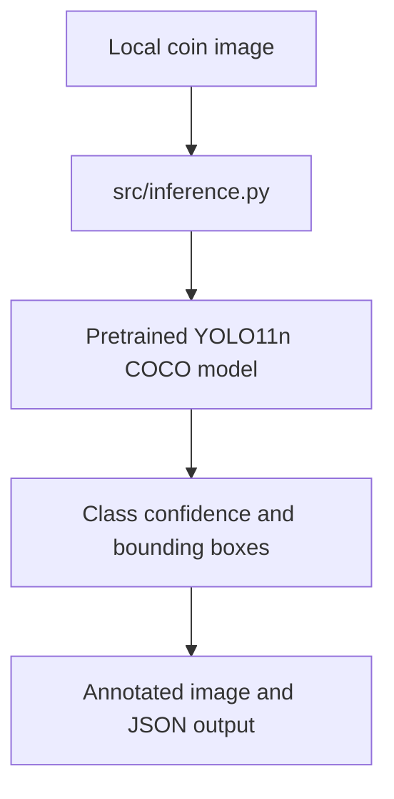
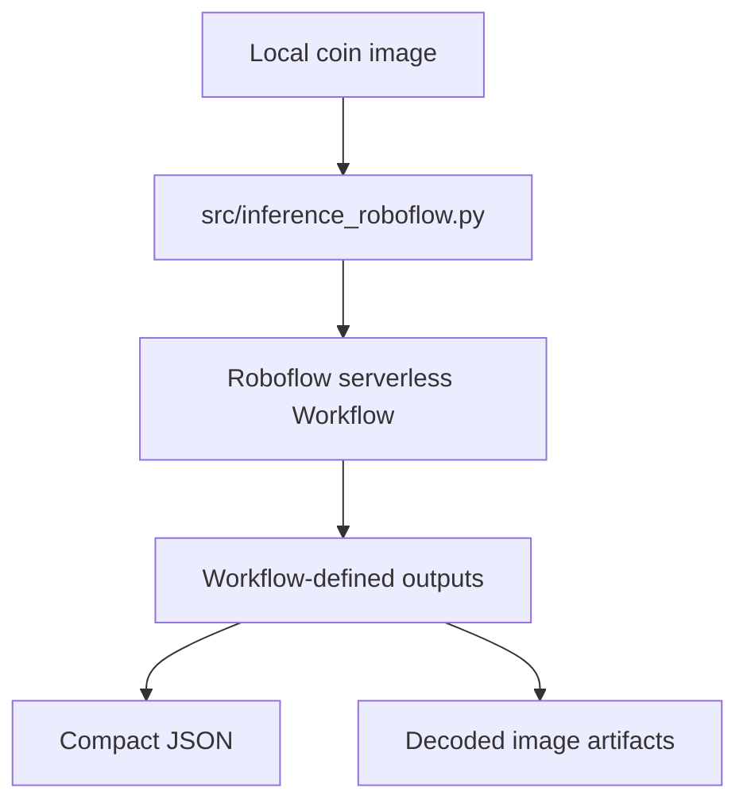
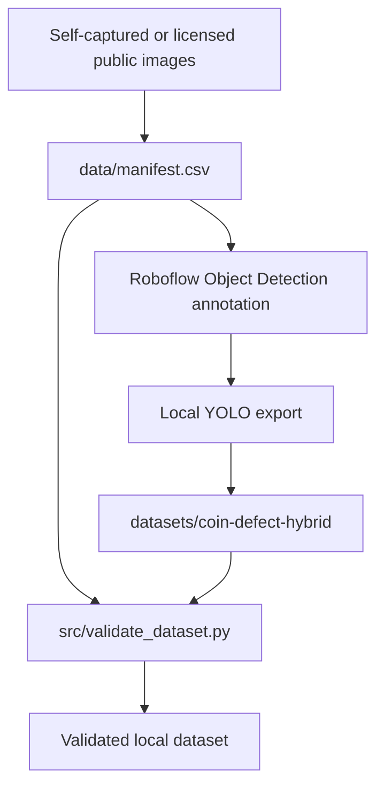
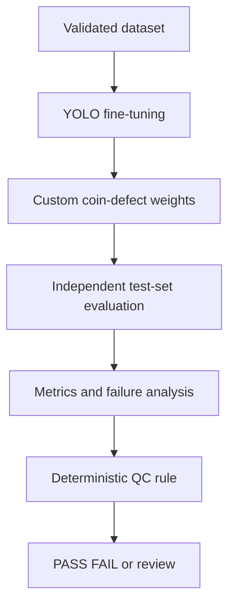

# Architecture

## System boundary

Coin-AOI currently runs locally and processes still images. It has no deployed
service, camera loop, dashboard, or automatic quality-control decision.

## Implemented flow



`src/inference.py` verifies the environment and output format. Its default
model is trained on COCO classes, so its predictions are not coin-defect
predictions.

The optional hosted path uses the published Roboflow version 9 Workflow:



The API key is read only from `ROBOFLOW_API_KEY`. The client validates the
documented list response, discovers output names from the response, and writes
base64 image-shaped outputs to separate files. The integration exists locally,
but a successful hosted execution is not yet verified because the published
endpoint returned HTTP 500 on 2026-08-17.

## Dataset preparation flow



Raw images and Roboflow exports are local-only. Git tracks the manifest,
annotation rules, class configuration, and validation code rather than the
image files or model weights.

## Data contract

The current Roboflow export uses this mapping:

```text
0 dent
1 scratch
2 stain_corrosion
```

[`data.yaml`](../datasets/coin-defect-hybrid/data.yaml) is the local source of
truth for this mapping.

Each manifest row records an `image_id`, a physical `coin_id`, source metadata,
the assigned split, and annotation status. All views of the same physical coin
must remain in one split to prevent data leakage.

A normal image is a negative detection sample: it has no defect bounding boxes
and must export with an empty label file. It is not a `normal` detection class.

## Planned experiment flow



The planned flow is not implemented. Fine-tuning, evaluation, and QC rules must
not be described as current functionality until each has reproducible evidence.
