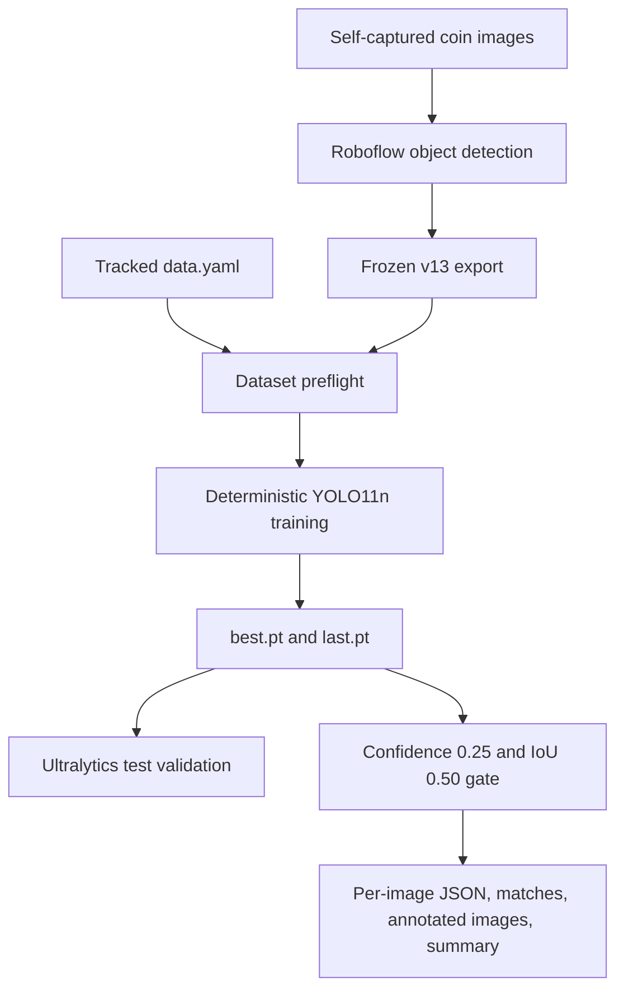
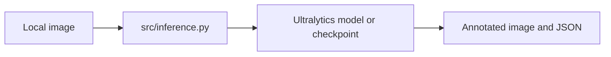
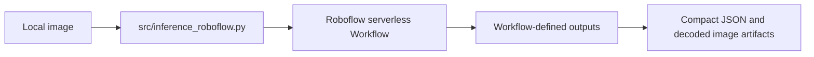

# Architecture

## System boundary

Coin-AOI is a local, still-image computer-vision experiment. It includes data
validation, YOLO training, checkpoint evaluation, evidence persistence, and an
optional hosted client. It does not include a camera loop, dashboard, deployed
service, or automatic quality-control decision.

## Implemented v13 flow



`src/v13_pipeline.py` resolves the dataset descriptor and validates each split.
It accepts normalized YOLO boxes, converts polygon rows to enclosing detection
boxes, rejects illegal class IDs or coordinates, and exposes pure IoU matching
helpers used by tests and evaluation.

`src/train_v13.py` performs preflight before loading the requested model. The
local reference run fixes CPU, 640px, batch 2, workers 0, seed 0,
deterministic mode, no image cache, and no online geometric, colour, flip,
Mosaic, MixUp, or copy-paste augmentation. Preflight and formal training start
separately from the original `yolo11n.pt`.

`src/evaluate_v13.py` requires the exact C005, C006, and C013 test cases. It
loads labels as ground truth, predicts at the frozen confidence, greedily
matches unused detections of the same class by IoU, and fails unless both
positive cases match and the normal case has no detections. Extra boxes on a
positive image are recorded but do not alter the current smoke rule.

## Data contract

The current class mapping is:

```text
0 dent
1 scratch
2 stain_corrosion
```

Confirmed normal images have empty label files; `normal` is not an object
class. Every capture of one physical coin must remain in one split before
augmentation. The current v13 export contains 93 train, 6 validation, and 3
test files derived from 40 pre-augmentation source images.

Raw images and Roboflow exports remain local. Git tracks descriptors,
manifests, annotation rules, validation code, and a small set of public,
secret-free evidence instead of full datasets or model weights.

## Local inference utility



The default `yolo11n.pt` is pretrained on COCO and is only an environment and
output-format check. It is not a coin-defect model unless a custom checkpoint
is supplied.

## Optional hosted branch



The client reads `ROBOFLOW_API_KEY` from the environment, validates TLS and the
documented list response, retries bounded transient failures, and keeps the
secret out of URLs and evidence files. The integration code and offline tests
are implemented; a successful hosted execution is not verified because the
published v9 endpoint last returned HTTP 500.

## Future product boundary

A production inspector would additionally require a representative independent
test set, calibrated decision policy, camera and lighting controls, latency
requirements, deployment monitoring, data drift review, and a human-review
path for uncertain cases. Those capabilities are intentionally outside the
current portfolio prototype.
